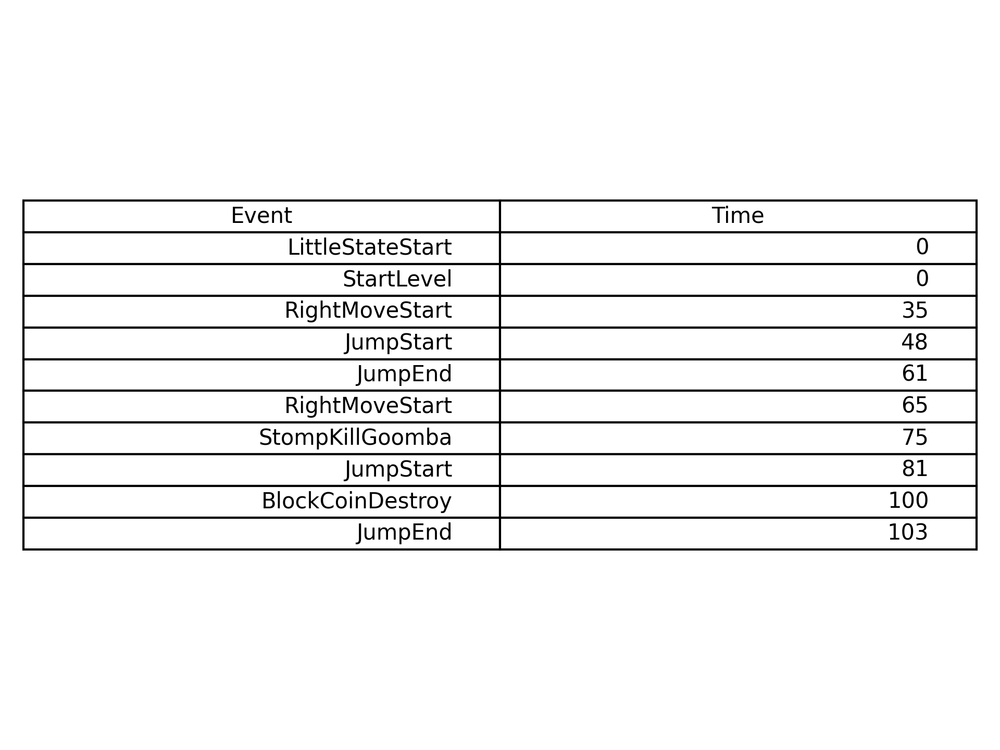
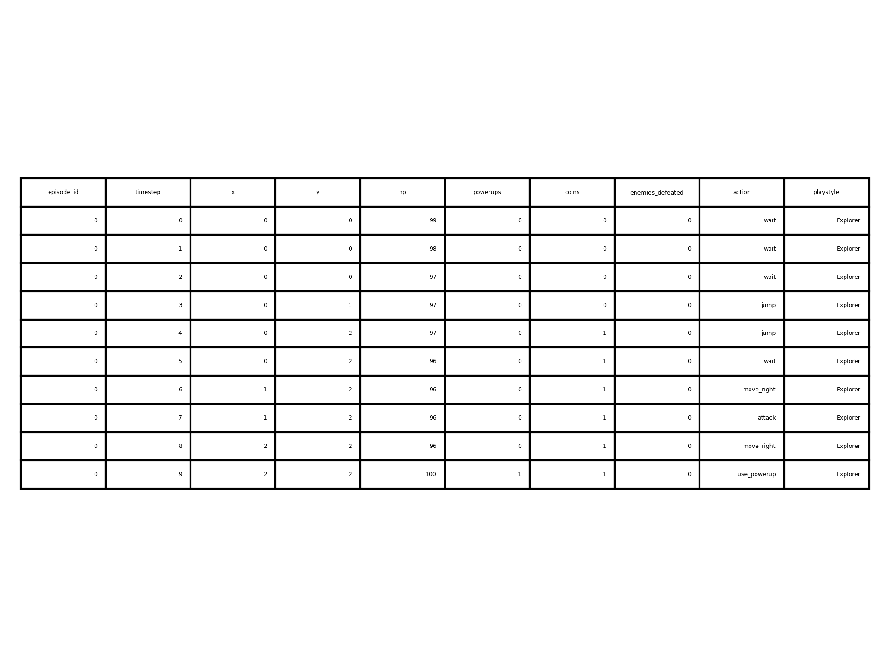
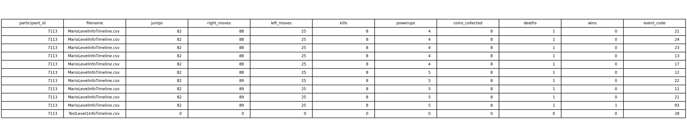
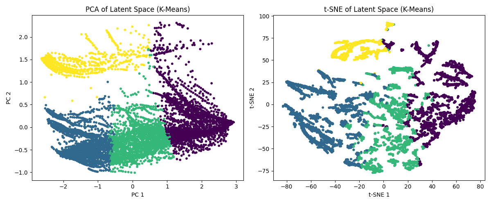

The scripts
MarioPCGStudy\AnonymizedDirectory\mario_trajectory_generation.py
and
MarioPCGStudy\AnonymizedDirectory\mario_trajs_to_npy.py
are responsible for generating the Mario_trajs.npy file from the raw Mario dataset. This .npy file is then used for training and clustering with the models.


📅 Progress Log (First 3 Weeks)

Week 1 – Dataset Acquisition & Initial Understanding

Acquired two datasets:

1. Mario Dataset — Gameplay logs from 74 human players across 11 levels, containing detailed event timelines.


2. Runebound Depths Synthetic Dataset — Internally generated labelled trajectories simulating various playstyles (e.g., runner, aggressor, explorer, magician).


Studied dataset structures and folder organization to understand event encoding and session structure.


---

Week 2 – Trajectory Construction & Preprocessing

Designed a trajectory representation for sequential modelling:

Features: jumps, kills, coins, powerups, deaths, and movement counts per timestep.

Each trajectory corresponds to a single playthrough sequence.


Wrote a preprocessing pipeline to:

Read all player-level CSV logs from the Mario dataset

Convert raw event logs into cumulative event-count sequences

Combine all trajectories into a single file (combined_trajectories.csv)


Applied similar formatting to the Runebound Depths dataset to ensure both datasets have a consistent input structure.


---

Week 3 – Data Formatting & First Model Implementation

Converted both datasets into .npy format for faster loading:

mario_sequences_augmented.npy (~7,000 sequences)

runebound_depths_synthetic_10000.npy (10,000 labelled sequences)


Implemented the LSTM Autoencoder in PyTorch:

Encodes sequences into a low-dimensional latent space

Reconstructs input sequences for unsupervised feature learning


Applied K-Means and Gaussian Mixture Models (GMM) to latent vectors for clustering.

Evaluated clustering performance using:

Silhouette Score

Davies–Bouldin Index

Latent space visualization via PCA and t-SNE


Established an evaluation pipeline that will be reused for all four models for fair comparison.


---
## Sample of Datasets

**CSV sample of raw datasets:**
**CSV sample of raw  mario dataset:**

**CSV sample of raw Runebound dataset:**


**CSV sample of processed Mario dataset:**





---

✅ Next Steps:

Implement VAE, LSTM-VAE, and Transformer-based Autoencoder.

Train and evaluate all models on both Mario and Runebound Depths datasets.


Compare clustering quality, reconstruction accuracy, and latent space structure.

# Week 4 -5 Progress Report

## 📌 I shifted from probability-based synthetic dataset generation to reinforcement learning–driven synthetic datasets.

This week I made a major pivot in the project direction.  
Instead of continuing with the **supervised synthetic dataset**, I took advice and shifted to a **reinforcement learning (RL)** approach.  
RL aligns much better with the problem: training agents to learn behaviors dynamically in an environment rather than fitting on pre-labeled data.

---

## 🏗️ Environment Setup
- Implemented a **custom Gymnasium environment** (`RuneboundDepthsEnv`) to support multiple playstyles:
  - **Runner**
  - **Explorer**
  - **Magician**
  - **Aggressor**
- Added **Pygame visualization** for debugging and monitoring agent behavior.  
  This has been very helpful for checking whether the policies being learned actually match my intentions.

---

## 🤖 Agent Training Results
Using **PPO from Stable-Baselines3**, I trained agents for each playstyle:

- ✅ **Runner**  
  Performs strongly. Learns to reliably reach the exit — reward shaping here is working well.

- ✅ **Explorer**  
  Does reasonably well. Explores sufficiently and provides a good foundation for the **next step: trajectory creation**.

- ⚠️ **Magician**  
  Struggles to learn meaningful behavior. Current shaping isn’t enough to guide it toward powerups.

- ⚠️ **Aggressor**  
  Also underperforming. Fails to consistently seek out or eliminate enemies despite reward incentives.

---

## 🚀 Next Steps
- Continue development with **Runner** and **Explorer** agents (enough progress to move into trajectory generation).  
- **Defer Magician & Aggressor** for now to avoid stalling progress.  
- Revisit these two playstyles later once the pipeline is more mature and other pieces are in place.

---

## 🔎 Summary
Week 4-5 was a key turning point:  
- Pivoted from probability and randomly generated synthetic data → reinforcement learning.  
- Built a working Gym environment with Pygame-based visualization.  
- Trained agents with mixed results:
  - Runner and Explorer: ✅ usable progress
  - Magician and Aggressor: ⚠️ not yet working  
- Clear path forward: focus on what works now.

## RuneboundDepthsEnv: Why MAGICIAN and AGGRESSOR Playstyles May Not Work

### Overview
The `RuneboundDepthsEnv` is a Gymnasium environment where an agent navigates a grid to collect coins, powerups, defeat enemies, or reach an exit, guided by playstyles (`RUNNER`, `EXPLORER`, `MAGICIAN`, `AGGRESSOR`). Using PPO from Stable Baselines3, `MAGICIAN` (targets powerups) and `AGGRESSOR` (targets enemies) agents fail to move effectively, often getting stuck. Below, we explain the root causes and fundamental issues, focusing on rewards and environment dynamics.

### Root Causes

1. **Sparse Rewards**:
   - **Issue**: The style rewards for `MAGICIAN` and `AGGRESSOR` (`W_OBJECT=0.07`) are small compared to the step penalty (`-0.01`) and collection rewards (`+2.0` for powerups/enemies). The agent rarely encounters powerups/enemies randomly, leading to negative reward accumulation and a policy that avoids movement to minimize penalties.
   - **Impact**: PPO converges to a suboptimal policy, often selecting boundary actions (e.g., "up" at `x=0`), causing the agent to "freeze."

2. **Uninitialized Distance Trackers**:
   - **Issue**: The `_magic_prev_target_dist` and `_agg_prev_target_dist` variables are not initialized in `_reset_globals`, causing zero style rewards on the first step. This reduces the effective reward signal for `MAGICIAN` and `AGGRESSOR`.
   - **Impact**: Weak initial guidance hinders PPO's ability to learn navigation toward powerups or enemies.

3. **Zero-Padding in Observations**:
   - **Issue**: Absent powerups/enemies are padded with `(0,0)` in the observation space, which the agent may misinterpret as valid targets at the grid origin, leading to movement toward `(0,0)` and boundary sticking.
   - **Impact**: Confuses the policy, especially for `MAGICIAN` and `AGGRESSOR`, which rely on specific entity positions.

4. **Insufficient Exploration in PPO**:
   - **Issue**: With only 250,000 timesteps and default PPO hyperparameters, exploration is limited on a 12x12 grid with sparse targets (3 powerups/enemies). The step penalty dominates, discouraging movement.
   - **Impact**: The policy collapses to a low-variance, ineffective strategy.

### Fundamental Reward Issues
- **Reward Design**: Rewards must be dense and scaled appropriately:
  - **Environment Rewards**: Step penalty (`-0.01`), coin (`+0.5`), powerup/enemy (`+2.0`), exit (`+3.0`) are sparse, especially for `MAGICIAN` and `AGGRESSOR`, which rely on rare powerup/enemy encounters.
  - **Style Rewards**: `W_OBJECT=0.07` for distance reduction is too weak compared to the step penalty, providing insufficient gradient for learning. Normalizing by grid size and increasing to `0.2` helps.
  - **Boundary Actions**: Ineffective moves (e.g., hitting a wall) incur only the step penalty, encouraging the agent to stay still to avoid further penalties.
- **Sparsity**: With only 3 powerups/enemies on a 12x12 grid, the agent needs significant exploration to encounter positive rewards, which PPO struggles to achieve with default settings.

### Proposed Fixes
1. **Enhance Rewards**:
   - Increase `W_OBJECT` to `0.2` and normalize distance rewards (`(prev - curr)/grid_size`).
   - Add a proximity bonus (e.g., `0.1/(1 + curr_dist)`) for being near powerups/enemies.
   - Penalize ineffective boundary moves (`-0.02`).
2. **Fix Initialization**:
   - Initialize `_magic_prev_target_dist` and `_agg_prev_target_dist` in `_reset_globals`.
3. **Improve Observations**:
   - Use `(-1,-1)` for padding absent entities to avoid origin confusion.
4. **Adjust PPO Training**:
   - Increase timesteps to 500,000.
   - Use `learning_rate=1e-3`, `n_steps=2048` for better exploration.
   - Start with a smaller grid (e.g., 8x8) and more entities (5 each) for denser rewards.

### Next Steps
- Run the updated environment with debug prints to verify reward behavior.
- Evaluate the trained policy with rendering to observe movement toward powerups (`MAGICIAN`) or enemies (`AGGRESSOR`).
- Monitor TensorBoard for `rollout/ep_rew_mean` to ensure positive rewards.

These changes address the core issues, enabling `MAGICIAN` and `AGGRESSOR` to learn effective navigation.
```
